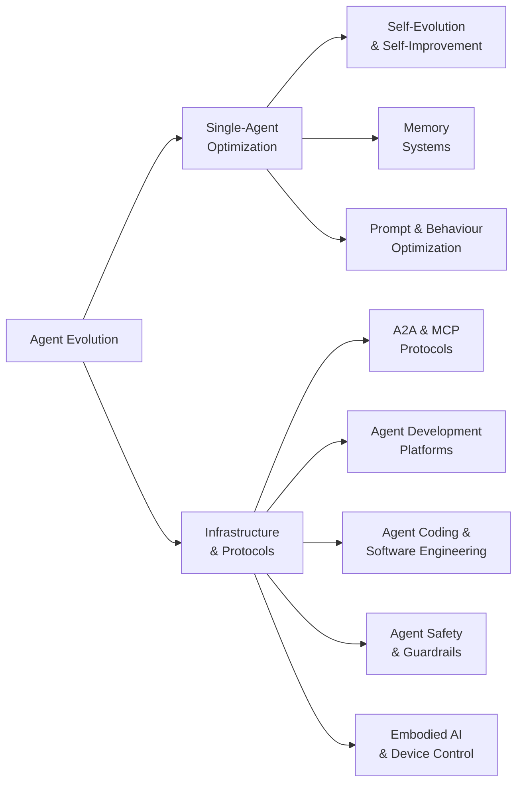

# Awesome Agent Evolution with stars

> AI Agent self-evolution, memory systems, autonomous self-improvement, and the infrastructure that powers them.

## Contents

* [Taxonomy](#taxonomy)
* [Agent Evolution and Self-Improvement](#agent-evolution-and-self-improvement)
* [Memory Systems](#memory-systems)
* [Agent-to-Agent Protocols](#agent-to-agent-protocols)
* [Agent Development Platforms](#agent-development-platforms)
* [Agent Coding and Software Engineering](#agent-coding-and-software-engineering)
* [Prompt and Behaviour Optimization](#prompt-and-behaviour-optimization)
* [Agent Safety and Guardrails](#agent-safety-and-guardrails)
* [Embodied AI](#embodied-ai)
* [Key Research Papers](#key-research-papers)
* [Benchmarks and Evaluation](#benchmarks-and-evaluation)
* [Community and Knowledge](#community-and-knowledge)

## Taxonomy

## Agent Evolution and Self-Improvement

Projects focused on enabling AI agents to evolve, learn, and improve autonomously.

<!-- AUTOGEN:evolution -->

* [**Eliza**](https://github.com/elizaOS/eliza) ⭐ 19,032 | 🐛 517 | 🌐 TypeScript | 📅 2026-08-13 - Autonomous agents for everyone. A framework for creating and deploying AI agents that evolve over time. by [@elizaOS](https://github.com/elizaOS) (19,010 stars)
* [**Agent Zero**](https://github.com/agent0ai/agent-zero) ⭐ 18,852 | 🐛 153 | 🌐 Python | 📅 2026-08-12 - General-purpose AI agent framework that learns and evolves through interaction. by [@agent0ai](https://github.com/agent0ai) (18,845 stars)
* [**SuperAGI**](https://github.com/TransformerOptimus/SuperAGI) ⭐ 17,653 | 🐛 267 | 🌐 Python | 📅 2025-01-22 - A dev-first open source autonomous AI agent framework. Build, manage and run self-improving autonomous agents. by [@TransformerOptimus](https://github.com/TransformerOptimus) (17,653 stars)
* [**evolver**](https://github.com/EvoMap/evolver) ⭐ 8,963 | 🐛 14 | 🌐 JavaScript | 📅 2026-08-09 - The GEP-powered self-evolution engine for AI agents. Genome Evolution Protocol enables agents to evolve autonomously via mutation and selection. by [@EvoMap](https://github.com/EvoMap) (8,959 stars)
* [**OpenEvolve**](https://github.com/algorithmicsuperintelligence/openevolve) ⭐ 6,902 | 🐛 116 | 🌐 Python | 📅 2026-07-18 - Open-source evolutionary coding agent inspired by AlphaEvolve. Evolves code solutions through LLM-driven mutation and selection. by [@algorithmicsuperintelligence](https://github.com/algorithmicsuperintelligence) (6,895 stars)
* [**Agents (aiwaves)**](https://github.com/aiwaves-cn/agents) ⭐ 5,957 | 🐛 46 | 🌐 Python | 📅 2024-09-26 - An open-source framework for data-centric, self-evolving autonomous language agents. by [@aiwaves-cn](https://github.com/aiwaves-cn) (5,957 stars)
* [**EvoAgentX**](https://github.com/EvoAgentX/EvoAgentX) ⭐ 3,225 | 🐛 18 | 🌐 Python | 📅 2026-07-07 - Automated framework for evolving agentic workflows. Optimizes agent prompts, tools, and pipelines via evolutionary algorithms. by [@EvoAgentX](https://github.com/EvoAgentX) (3,221 stars)
* [**HyperAgents**](https://github.com/facebookresearch/HyperAgents) ⭐ 2,677 | 🐛 29 | 🌐 Python | 📅 2026-07-31 - Self-referential self-improving agents by Meta. DGM-Hyperagents add an optimization layer so agents edit their own improvement process. by [@facebookresearch](https://github.com/facebookresearch) (2,675 stars)
* [**SIA**](https://github.com/hexo-ai/sia) ⭐ 2,100 | 🐛 15 | 🌐 Python | 📅 2026-07-02 - Self-improving AI framework that autonomously optimizes the performance of any AI system through iterative evaluation and refinement. by [@hexo-ai](https://github.com/hexo-ai) (2,095 stars)
* [**Agent0**](https://github.com/aiming-lab/Agent0) ⭐ 1,246 | 🐛 9 | 🌐 Python | 📅 2026-07-10 - Self-evolving agent framework from UNC/Salesforce/Stanford. Improves without human-curated datasets via curriculum and executor agent competition. by [@aiming-lab](https://github.com/aiming-lab) (1,244 stars)
* [**Ouroboros**](https://github.com/razzant/ouroboros) ⭐ 1,125 | 🐛 80 | 🌐 Python | 📅 2026-08-13 - Self-creating AI agent that writes its own code and evolves autonomously. Completed 30+ evolution cycles in first 24 hours with zero human intervention. by [@razzant](https://github.com/razzant) (1,109 stars)
* [**A-Evolve**](https://github.com/A-EVO-Lab/a-evolve) ⭐ 724 | 🐛 9 | 🌐 Python | 📅 2026-06-29 - The PyTorch for Agentic AI. Open-source infrastructure that evolves any agent across any domain with zero human intervention. #1 on MCP-Atlas (79.4%). by [@A-EVO-Lab](https://github.com/A-EVO-Lab) (724 stars)
* [**SEAgent**](https://github.com/SunzeY/SEAgent) ⭐ 262 | 🐛 1 | 🌐 Python | 📅 2025-08-07 - Self-Evolving Computer Use Agent with Autonomous Learning from Experience. by [@SunzeY](https://github.com/SunzeY) (262 stars)

<!-- /AUTOGEN:evolution -->

## Memory Systems

Vector, graph, episodic, and hybrid memory architectures for persistent agent cognition.

<!-- AUTOGEN:memory -->

* [**Mem0**](https://github.com/mem0ai/mem0) ⭐ 63,149 | 🐛 662 | 🌐 Python | 📅 2026-08-13 - Production-ready AI agent memory with scalable long-term memory. 26% improvement over baseline on LOCOMO benchmark with 91% latency reduction. by [@mem0ai](https://github.com/mem0ai) (63,082 stars)
* [**Cognee**](https://github.com/topoteretes/cognee) ⭐ 29,982 | 🐛 395 | 🌐 Python | 📅 2026-08-12 - Knowledge engine for AI agent memory. Build and query knowledge graphs from unstructured data in 6 lines of code. by [@topoteretes](https://github.com/topoteretes) (29,967 stars)
* [**agentmemory**](https://github.com/rohitg00/agentmemory) ⭐ 26,936 | 🐛 446 | 🌐 TypeScript | 📅 2026-08-10 - Persistent, benchmark-tuned memory for coding agents (Claude Code, Cursor, Copilot CLI, Codex, and any MCP client). Remembers context across sessions so you stop re-explaining. by [@rohitg00](https://github.com/rohitg00) (26,893 stars)
* [**Letta**](https://github.com/letta-ai/letta) ⭐ 24,219 | 🐛 43 | 🌐 Python | 📅 2026-08-01 - Platform for building stateful agents with advanced self-editing memory. Formerly MemGPT. by [@letta-ai](https://github.com/letta-ai) (24,207 stars)
* [**TencentDB Agent Memory**](https://github.com/TencentCloud/TencentDB-Agent-Memory) ⭐ 20,721 | 🐛 553 | 🌐 TypeScript | 📅 2026-08-11 - Fully local long-term memory for AI agents via a four-tier progressive storage architecture, from Tencent Cloud. by [@TencentCloud](https://github.com/TencentCloud) (20,108 stars)
* [**Memvid**](https://github.com/memvid/memvid) ⭐ 16,213 | 🐛 33 | 🌐 Rust | 📅 2026-07-14 - Single-file memory layer for AI Agents in Rust. +35% SOTA on LoCoMo with ultra-low latency (0.025ms P50). by [@memvid](https://github.com/memvid) (16,211 stars)
* [**memU**](https://github.com/NevaMind-AI/memU) ⭐ 14,294 | 🐛 110 | 🌐 Python | 📅 2026-08-12 - Memory system for 24/7 proactive agents. Persistent memory across sessions and platforms. by [@NevaMind-AI](https://github.com/NevaMind-AI) (14,289 stars)
* [**EverMemOS**](https://github.com/EverMind-AI/EverOS) ⭐ 11,978 | 🐛 69 | 🌐 Python | 📅 2026-08-11 - Long-term memory for 24/7 AI agents across LLMs and platforms. by [@EverMind-AI](https://github.com/EverMind-AI) (11,967 stars)
* [**ChatLab**](https://github.com/ChatLab/ChatLab) ⭐ 7,167 | 🐛 14 | 🌐 TypeScript | 📅 2026-08-12 - Rediscover your social memories with local, AI-powered analysis. 本地化的聊天记录分析工具，通过 AI Agent 回顾你的社交记忆。. by [@ChatLab](https://github.com/ChatLab) (7,159 stars)
* [**honcho**](https://github.com/plastic-labs/honcho) ⭐ 6,618 | 🐛 160 | 🌐 Python | 📅 2026-08-13 - Memory library for building stateful agents with user context management. by [@plastic-labs](https://github.com/plastic-labs) (6,600 stars)
* [**holaOS**](https://github.com/holaboss-ai/holaOS) ⭐ 6,066 | 🐛 6 | 🌐 TypeScript | 📅 2026-08-12 - Agent environment for long-horizon work, continuity, and self-evolution. by [@holaboss-ai](https://github.com/holaboss-ai) (5,866 stars)
* [**memgraph**](https://github.com/memgraph/memgraph) ⭐ 4,328 | 🐛 776 | 🌐 C++ | 📅 2026-08-12 - High-performance open-source in-memory graph database for GraphRAG, AI memory, agentic AI, and real-time graph analytics. Cypher-compatible, built in C++. by [@memgraph](https://github.com/memgraph) (4,325 stars)
* [**Acontext**](https://github.com/memodb-io/Acontext) ⭐ 3,666 | 🐛 36 | 🌐 JavaScript | 📅 2026-07-14 - Open-source skill memory layer for AI agents. Automatically captures learnings from agent runs and stores them as reusable skill files. by [@memodb-io](https://github.com/memodb-io) (3,666 stars)
* [**MemMachine**](https://github.com/MemMachine/MemMachine) ⭐ 3,346 | 🐛 89 | 🌐 Python | 📅 2026-08-11 - Universal memory layer for AI agents. Episodic (graph-based), profile (SQL), and working memory with scalable storage and retrieval. by [@MemMachine](https://github.com/MemMachine) (3,351 stars)
* [**ReMe**](https://github.com/agentscope-ai/ReMe) ⭐ 3,306 | 🐛 31 | 🌐 Python | 📅 2026-08-13 - Memory management kit for agents. File-based and vector-based memory systems. SOTA on LoCoMo and HaluMem benchmarks. by [@agentscope-ai](https://github.com/agentscope-ai) (3,302 stars)
* [**datachain**](https://github.com/datachain-ai/datachain) ⭐ 2,808 | 🐛 80 | 🌐 Python | 📅 2026-08-12 - Operational data context layer for AI agents providing typed and versioned datasets over multimodal content. by [@datachain-ai](https://github.com/datachain-ai) (2,807 stars)
* [**nocturne\_memory**](https://github.com/Dataojitori/nocturne_memory) ⭐ 1,313 | 🐛 5 | 🌐 Python | 📅 2026-08-09 - Lightweight, rollbackable Long-Term Memory Server for MCP Agents with graph-like structured memory. by [@Dataojitori](https://github.com/Dataojitori) (1,309 stars)
* [**Mem9**](https://github.com/mem9-ai/mem9) ⭐ 1,186 | 🐛 88 | 🌐 TypeScript | 📅 2026-08-12 - Unlimited persistent memory layer for AI agents. Cloud-synced memory across sessions and tools. by [@mem9-ai](https://github.com/mem9-ai) (1,183 stars)
* [**Awesome-AI-Memory**](https://github.com/IAAR-Shanghai/Awesome-AI-Memory) ⭐ 1,154 | 🐛 15 | 🌐 Python | 📅 2026-07-14 - Curated knowledge base on AI memory for LLMs and agents, covering long-term memory, reasoning, retrieval, and system design. by [@IAAR-Shanghai](https://github.com/IAAR-Shanghai) (1,154 stars)
* [**Awesome-Agent-Memory**](https://github.com/TeleAI-UAGI/Awesome-Agent-Memory) ⭐ 578 | 🐛 0 | 🌐 Python | 📅 2026-08-12 - Curated systems, benchmarks, and papers on memory for LLMs/MLLMs -- long-term context, retrieval, and reasoning. by [@TeleAI-UAGI](https://github.com/TeleAI-UAGI) (576 stars)
* [**MemSkill**](https://github.com/ViktorAxelsen/MemSkill) ⭐ 560 | 🐛 6 | 🌐 Python | 📅 2026-05-23 - Learning and evolving memory skills for self-evolving agents. Meta-memory that determines what to extract, remember, and forget. by [@ViktorAxelsen](https://github.com/ViktorAxelsen) (560 stars)
* [**TeleMem**](https://github.com/TeleAI-UAGI/telemem) ⭐ 482 | 🐛 1 | 🌐 Python | 📅 2026-08-10 - High-performance drop-in Mem0 replacement. 19% higher accuracy, 43% fewer tokens, and 2.1x speedup via narrative dynamic extraction. by [@TeleAI-UAGI](https://github.com/TeleAI-UAGI) (481 stars)

<!-- /AUTOGEN:memory -->

## Agent-to-Agent Protocols

Standards and protocols for inter-agent communication and interoperability.

<!-- AUTOGEN:protocols -->

* [**Google A2A**](https://github.com/a2aproject/A2A) ⭐ 25,322 | 🐛 225 | 🌐 Shell | 📅 2026-08-12 - Google's open Agent-to-Agent protocol. Enables agent discovery, secure collaboration, and long-running tasks while preserving agent opacity. by [@a2aproject](https://github.com/a2aproject) (25,307 stars)
* [**mcp-use**](https://github.com/mcp-use/mcp-use) ⭐ 10,484 | 🐛 87 | 🌐 TypeScript | 📅 2026-08-12 - The fullstack MCP framework to develop MCP Apps for ChatGPT/Claude and MCP Servers for AI Agents. by [@mcp-use](https://github.com/mcp-use) (10,479 stars)
* [**openagent**](https://github.com/the-open-agent/openagent) ⭐ 5,510 | 🐛 48 | 🌐 Go | 📅 2026-08-07 - Enterprise AI platform with MCP and A2A protocol management, knowledge base, and admin interface. by [@the-open-agent](https://github.com/the-open-agent) (5,510 stars)
* [**ViteMCP**](https://github.com/punkpeye/fastmcp) ⭐ 3,250 | 🐛 20 | 🌐 TypeScript | 📅 2026-08-12 - A TypeScript framework for building MCP servers. by [@punkpeye](https://github.com/punkpeye) (3,249 stars)
* [**arcade-mcp**](https://github.com/ArcadeAI/arcade-mcp) ⭐ 1,002 | 🐛 12 | 🌐 Python | 📅 2026-08-13 - MCP server framework and tool-development library for building custom agent capabilities and authenticated tool calls. by [@ArcadeAI](https://github.com/ArcadeAI) (1,001 stars)
* [**A2A x402**](https://github.com/google-agentic-commerce/a2a-x402) ⭐ 549 | 🐛 60 | 🌐 Python | 📅 2026-08-04 - A2A protocol extension adding x402 on-chain payments, letting agents monetize services over Agent-to-Agent calls. by [@google-agentic-commerce](https://github.com/google-agentic-commerce) (549 stars)
* [**GEP MCP Server**](https://github.com/EvoMap/gep-mcp-server) ⭐ 6 | 🐛 3 | 🌐 JavaScript | 📅 2026-07-01 - MCP Server for Genome Evolution Protocol. Exposes evolution tools to Claude Desktop, Cursor, and any MCP client. by [@EvoMap](https://github.com/EvoMap) (6 stars)

<!-- /AUTOGEN:protocols -->

## Agent Development Platforms

Platforms and tools for building, deploying, and managing AI agents.

<!-- AUTOGEN:platforms -->

* [**dify**](https://github.com/langgenius/dify) ⭐ 152,276 | 🐛 1,065 | 🌐 TypeScript | 📅 2026-08-13 - Production-ready platform for building agentic AI workflows with visual orchestration. by [@langgenius](https://github.com/langgenius) (152,161 stars)
* [**LangChain**](https://github.com/langchain-ai/langchain) ⭐ 144,120 | 🐛 412 | 🌐 Python | 📅 2026-08-13 - Full-stack agent engineering platform with composable chains, tools, and memory integration. by [@langchain-ai](https://github.com/langchain-ai) (144,046 stars)
* [**OpenHands**](https://github.com/OpenHands/OpenHands) ⭐ 83,853 | 🐛 469 | 🌐 TypeScript | 📅 2026-08-13 - Open platform for AI software developers as generalist agents. Autonomous coding, debugging, and deployment. by [@OpenHands](https://github.com/OpenHands) (83,763 stars)
* [**CowAgent**](https://github.com/zhayujie/CowAgent) ⭐ 46,476 | 🐛 39 | 🌐 Python | 📅 2026-08-13 - Super AI assistant based on LLMs with autonomous thinking, task planning, skill creation, and long-term memory. by [@zhayujie](https://github.com/zhayujie) (46,467 stars)
* [**agno**](https://github.com/agno-agi/agno) ⭐ 41,682 | 🐛 1,228 | 🌐 Python | 📅 2026-08-13 - Production-ready agent framework that turns agents into deployable services with multi-framework support. by [@agno-agi](https://github.com/agno-agi) (41,672 stars)
* [**langgraph**](https://github.com/langchain-ai/langgraph) ⭐ 39,568 | 🐛 684 | 🌐 Python | 📅 2026-08-12 - Build resilient language agents as stateful graphs with persistence and streaming. by [@langchain-ai](https://github.com/langchain-ai) (39,503 stars)
* [**CoPaw**](https://github.com/agentscope-ai/QwenPaw) ⭐ 33,741 | 🐛 995 | 🌐 Python | 📅 2026-08-13 - Co Personal Agent Workstation built on AgentScope. Desktop agent platform with multi-agent collaboration and tool integration. by [@agentscope-ai](https://github.com/agentscope-ai) (33,763 stars)
* [**mastra**](https://github.com/mastra-ai/mastra) ⭐ 27,153 | 🐛 442 | 🌐 TypeScript | 📅 2026-08-13 - TypeScript framework for building AI-powered applications with agent workflows and RAG. by [@mastra-ai](https://github.com/mastra-ai) (27,114 stars)
* [**AgenticSeek**](https://github.com/Fosowl/agenticSeek) ⭐ 26,790 | 🐛 32 | 🌐 Python | 📅 2026-08-11 - Fully local autonomous agent with browsing, coding, and multi-agent capabilities. No API keys required. by [@Fosowl](https://github.com/Fosowl) (26,786 stars)
* [**haystack**](https://github.com/deepset-ai/haystack) ⭐ 26,189 | 🐛 95 | 🌐 Python | 📅 2026-08-12 - Open-source AI orchestration framework for building context-engineered production applications. by [@deepset-ai](https://github.com/deepset-ai) (26,184 stars)
* [**Coze Studio**](https://github.com/coze-dev/coze-studio) ⭐ 21,444 | 🐛 539 | 🌐 TypeScript | 📅 2026-07-29 - AI agent development platform with visual tools for creating, debugging, and deploying agents. by [@coze-dev](https://github.com/coze-dev) (21,435 stars)
* [**Google ADK**](https://github.com/google/adk-python) ⭐ 21,089 | 🐛 560 | 🌐 Python | 📅 2026-08-13 - Open-source Python toolkit by Google for building, evaluating, and deploying sophisticated AI agents. by [@google](https://github.com/google) (21,078 stars)
* [**PydanticAI**](https://github.com/pydantic/pydantic-ai) ⭐ 19,258 | 🐛 699 | 🌐 Python | 📅 2026-08-13 - Type-safe AI agent framework built on Pydantic with structured outputs and dependency injection. by [@pydantic](https://github.com/pydantic) (19,243 stars)
* [**Parlant**](https://github.com/emcie-co/parlant) ⭐ 18,244 | 🐛 42 | 🌐 Python | 📅 2026-07-12 - The conversational control layer for customer-facing AI agents. A context-engineering framework for controlling interactions. by [@emcie-co](https://github.com/emcie-co) (18,241 stars)
* [**OpenFang**](https://github.com/RightNow-AI/openfang) ⭐ 18,111 | 🐛 118 | 🌐 Rust | 📅 2026-07-02 - Open-source Agent Operating System for deploying and managing AI agents. by [@RightNow-AI](https://github.com/RightNow-AI) (18,105 stars)
* [**agents**](https://github.com/livekit/agents) ⭐ 12,958 | 🐛 753 | 🌐 Python | 📅 2026-08-13 - Framework for building realtime voice AI agents with speech-to-speech pipelines. by [@livekit](https://github.com/livekit) (12,939 stars)
* [**ten-framework**](https://github.com/TEN-framework/ten-framework) ⭐ 11,040 | 🐛 224 | 🌐 Python | 📅 2026-08-06 - Open-source framework for building conversational voice AI agents. by [@TEN-framework](https://github.com/TEN-framework) (11,040 stars)
* [**Agent-Squad**](https://github.com/2FastLabs/agent-squad) ⭐ 7,735 | 🐛 85 | 🌐 Swift | 📅 2026-08-12 - Flexible framework for managing multiple AI agents and handling complex conversations. by [@2FastLabs](https://github.com/2FastLabs) (7,735 stars)
* [**PySpur**](https://github.com/PySpur-Dev/pyspur) ⭐ 5,769 | 🐛 41 | 🌐 TypeScript | 📅 2026-06-29 - Visual playground for agentic workflows with rapid iteration on multi-agent pipelines. by [@PySpur-Dev](https://github.com/PySpur-Dev) (5,769 stars)
* [**MS-Agent**](https://github.com/modelscope/ms-agent) ⭐ 4,359 | 🐛 23 | 🌐 Python | 📅 2026-08-12 - Lightweight framework by ModelScope to empower agentic execution of complex tasks with memory and deep research. by [@modelscope](https://github.com/modelscope) (4,359 stars)

<!-- /AUTOGEN:platforms -->

## Agent Coding and Software Engineering

AI agents that write, debug, and maintain code autonomously.

<!-- AUTOGEN:coding -->

* [**Claude Code**](https://github.com/anthropics/claude-code) ⭐ 141,263 | 🐛 15,918 | 🌐 Python | 📅 2026-08-12 - Terminal-native agentic coding tool from Anthropic. Understands your codebase and executes tasks through natural language. by [@anthropics](https://github.com/anthropics) (141,126 stars)
* [**Codex**](https://github.com/openai/codex) ⭐ 105,592 | 🐛 12,417 | 🌐 Rust | 📅 2026-08-13 - Lightweight coding agent from OpenAI written in Rust. Runs locally as CLI, IDE extension, or desktop app. by [@OpenAI](https://github.com/OpenAI) (105,429 stars)
* [**Pi**](https://github.com/earendil-works/pi) ⭐ 88,785 | 🐛 114 | 🌐 TypeScript | 📅 2026-08-12 - Self-extensible coding agent and agent harness. Bundles an interactive coding CLI, an agent runtime with tool calling and state, and a unified multi-provider LLM API. by [@earendil-works](https://github.com/earendil-works) (87,957 stars)
* [**agent-skills**](https://github.com/addyosmani/agent-skills) ⭐ 86,658 | 🐛 112 | 🌐 JavaScript | 📅 2026-08-11 - Production-grade engineering skills and best practices for AI coding agents. by [@addyosmani](https://github.com/addyosmani) (86,353 stars)
* [**Taste-Skill**](https://github.com/Leonxlnx/taste-skill) ⭐ 75,936 | 🐛 53 | 🌐 JavaScript | 📅 2026-07-23 - High-Agency frontend skill that helps AI generate less generic, more tasteful outputs. by [@Leonxlnx](https://github.com/Leonxlnx) (75,575 stars)
* [**Cline**](https://github.com/cline/cline) ⭐ 66,096 | 🐛 983 | 🌐 TypeScript | 📅 2026-08-13 - Autonomous coding agent available as an IDE extension, CLI, or SDK. Plans and executes multi-step edits with human-in-the-loop approval. by [@cline](https://github.com/cline) (66,030 stars)
* [**goose**](https://github.com/aaif-goose/goose) ⭐ 52,738 | 🐛 251 | 🌐 Rust | 📅 2026-08-13 - Open-source extensible AI coding agent that goes beyond code suggestions. by [@aaif-goose](https://github.com/aaif-goose) (52,702 stars)
* [**Aider**](https://github.com/Aider-AI/aider) ⭐ 48,158 | 🐛 1,794 | 🌐 Python | 📅 2026-05-22 - AI pair programming in your terminal. Edit code with LLMs across 100+ languages with deep Git integration. by [@Aider-AI](https://github.com/Aider-AI) (48,135 stars)
* [**Qwen Code**](https://github.com/QwenLM/qwen-code) ⭐ 26,954 | 🐛 945 | 🌐 TypeScript | 📅 2026-08-13 - Open-source AI coding agent that lives in your terminal, optimized for Qwen-Coder models. by [@QwenLM](https://github.com/QwenLM) (26,936 stars)
* [**SWE-Agent**](https://github.com/SWE-agent/SWE-agent) ⭐ 20,052 | 🐛 67 | 🌐 Python | 📅 2026-08-10 - Automatically fix GitHub issues and handle cybersecurity challenges. State-of-the-art on SWE-bench. by [@SWE-agent](https://github.com/SWE-agent) (20,047 stars)
* [**context-mode**](https://github.com/mksglu/context-mode) ⭐ 19,830 | 🐛 148 | 🌐 TypeScript | 📅 2026-08-12 - Context window optimization tool for AI coding agents with sandboxed tool output and 98% token reduction. by [@mksglu](https://github.com/mksglu) (19,807 stars)
* [**Devika**](https://github.com/stitionai/devika) ⭐ 19,558 | 🐛 196 | 🌐 Python | 📅 2025-09-25 - The first open-source implementation of an Agentic Software Engineer. An open-source alternative to Devin. by [@stitionai](https://github.com/stitionai) (19,558 stars)
* [**Plandex**](https://github.com/plandex-ai/plandex) ⭐ 15,580 | 🐛 60 | 🌐 Go | 📅 2025-10-03 - Open-source AI coding agent designed for large projects and complex real-world tasks with persistent context. by [@plandex-ai](https://github.com/plandex-ai) (15,582 stars)
* [**Trae Agent**](https://github.com/bytedance/trae-agent) ⭐ 12,018 | 🐛 159 | 🌐 Python | 📅 2026-02-05 - LLM-based agent by ByteDance for general-purpose software engineering tasks. by [@bytedance](https://github.com/bytedance) (12,016 stars)
* [**Open SWE**](https://github.com/langchain-ai/open-swe) ⭐ 10,545 | 🐛 23 | 🌐 Python | 📅 2026-08-12 - Open-source asynchronous coding agent by LangChain for software engineering tasks. by [@langchain-ai](https://github.com/langchain-ai) (10,537 stars)
* [**Mini-SWE-Agent**](https://github.com/SWE-agent/mini-swe-agent) ⭐ 6,435 | 🐛 38 | 🌐 Python | 📅 2026-08-10 - The 100-line AI agent that solves GitHub issues. Radically simple but scores >74% on SWE-bench verified. by [@SWE-agent](https://github.com/SWE-agent) (6,400 stars)
* [**Reflexion**](https://github.com/noahshinn/reflexion) ⭐ 3,228 | 🐛 24 | 🌐 Python | 📅 2025-01-14 - Language agents with verbal reinforcement learning. Agents that learn from mistakes through self-reflection. by [@noahshinn](https://github.com/noahshinn) (3,227 stars)

<!-- /AUTOGEN:coding -->

## Prompt and Behaviour Optimization

Tools and frameworks for automatically optimizing agent prompts, instructions, and behavioral patterns.

<!-- AUTOGEN:prompt-optimization -->

* [**Promptfoo**](https://github.com/promptfoo/promptfoo) ⭐ 24,185 | 🐛 497 | 🌐 TypeScript | 📅 2026-08-13 - Open-source LLM evaluation and red-teaming framework. Test prompts, agents, and RAGs with 90+ model providers and 67+ security plugins. by [@promptfoo](https://github.com/promptfoo) (24,151 stars)
* [**TextGrad**](https://github.com/zou-group/textgrad) ⭐ 3,694 | 🐛 66 | 🌐 Python | 📅 2025-07-25 - Automatic differentiation via text. Backpropagation through LLM-provided textual gradients, published in Nature. by [@zou-group](https://github.com/zou-group) (3,693 stars)

<!-- /AUTOGEN:prompt-optimization -->

## Agent Safety and Guardrails

Projects focused on controlling agent actions, enforcing policies, and preventing harmful behavior.

<!-- AUTOGEN:safety -->

* [**NeMo Guardrails**](https://github.com/NVIDIA-NeMo/Guardrails) ⭐ 6,932 | 🐛 215 | 🌐 Python | 📅 2026-08-13 - NVIDIA's toolkit for adding programmable guardrails to LLM conversational systems. Policy-based safety controls. by [@NVIDIA-NeMo](https://github.com/NVIDIA-NeMo) (6,926 stars)
* [**AgentDoG**](https://github.com/AI45Lab/AgentDoG) ⭐ 683 | 🐛 2 | 🌐 Python | 📅 2026-06-08 - Diagnostic guardrail framework for AI agent safety and security. Detects and intercepts unsafe agent behavior at runtime. by [@AI45Lab](https://github.com/AI45Lab) (683 stars)

<!-- /AUTOGEN:safety -->

## Embodied AI

Projects connecting AI agents to physical devices, robotics, and real-world environments.

<!-- AUTOGEN:embodied -->

* [**LeRobot**](https://github.com/huggingface/lerobot) ⭐ 26,614 | 🐛 782 | 🌐 Python | 📅 2026-08-12 - Open-source robotics framework by Hugging Face. Models, datasets, and tools for real-world robotics in PyTorch. (26,594 stars)
* [**Open-AutoGLM**](https://github.com/zai-org/Open-AutoGLM) ⭐ 25,993 | 🐛 258 | 🌐 Python | 📅 2026-03-06 - An Open Phone Agent Model and Framework. Unlocking the AI Phone for Everyone. by [@zai-org](https://github.com/zai-org) (25,989 stars)
* [**Nanobrowser**](https://github.com/nanobrowser/nanobrowser) ⭐ 13,553 | 🐛 73 | 🌐 TypeScript | 📅 2025-11-24 - Chrome extension for AI-powered web automation. Run multi-agent workflows using your own AI keys. by [@nanobrowser](https://github.com/nanobrowser) (13,550 stars)
* [**XcodeBuildMCP**](https://github.com/getsentry/XcodeBuildMCP) ⭐ 6,224 | 🐛 19 | 🌐 TypeScript | 📅 2026-08-12 - A MCP server and CLI for agent use when working on iOS and macOS projects. by [@getsentry](https://github.com/getsentry) (6,222 stars)
* [**Mobile MCP**](https://github.com/mobile-next/mobile-mcp) ⭐ 5,900 | 🐛 58 | 🌐 TypeScript | 📅 2026-08-09 - Model Context Protocol Server for Mobile Automation and Scraping (iOS, Android, Emulators and Real Devices). by [@mobile-next](https://github.com/mobile-next) (5,893 stars)
* [**agent-device**](https://github.com/callstack/agent-device) ⭐ 4,076 | 🐛 49 | 🌐 TypeScript | 📅 2026-08-12 - CLI that lets AI agents drive real iOS and Android devices — taps, text input, screenshots, and app control for mobile automation. by [@callstack](https://github.com/callstack) (4,063 stars)
* [**ROS-LLM**](https://github.com/Auromix/ROS-LLM) ⭐ 822 | 🐛 48 | 🌐 Python | 📅 2023-07-10 - Framework for embodied intelligence in ROS. Natural language interactions with LLMs for robot control. by [@Auromix](https://github.com/Auromix) (822 stars)
* [**RAI**](https://github.com/RobotecAI/rai) ⭐ 569 | 🐛 100 | 🌐 Python | 📅 2026-08-12 - Vendor-agnostic agentic framework for Physical AI and robotics. Connects LLM agents to ROS 2 tools for perception, reasoning, and control. by [@RobotecAI](https://github.com/RobotecAI) (569 stars)

<!-- /AUTOGEN:embodied -->

## Key Research Papers

### Surveys

* [A Comprehensive Survey of Self-Evolving AI Agents](https://arxiv.org/abs/2508.07407) (arXiv'25) - Unified framework with four components: System Inputs, Agent System, Environment, and Optimisers. Covers evolution of models, prompts, memory, tools, and workflows.
* [A Survey of Self-Evolving Agents: What, When, How, and Where to Evolve](https://arxiv.org/abs/2507.21046) (TMLR'26) - Organizes around what to evolve, when to evolve, and how to evolve. Covers intra-test-time and inter-test-time adaptation.
* [Memory for Autonomous LLM Agents: Mechanisms, Evaluation, and Emerging Frontiers](https://arxiv.org/abs/2603.07670) (arXiv'26) - Formalizes agent memory as write-manage-read loop. Taxonomy spanning temporal scope, representational substrate, and control policy.

### Self-Evolution and Lifelong Learning

* [Live-SWE-agent: Can Software Engineering Agents Self-Evolve on the Fly?](https://arxiv.org/abs/2511.13646) (arXiv'25) - First live agent that autonomously evolves itself during runtime. 77.4% on SWE-bench Verified.
* [EvoClaw: Evaluating AI Agents on Continuous Software Evolution](https://arxiv.org/abs/2603.13428) (arXiv'26) - Benchmark revealing performance drops from >80% to at most 38% in continuous evolution settings.
* [Symbolic Learning Enables Self-Evolving Agents](https://arxiv.org/abs/2406.18532) (arXiv'24) - Agents that evolve through symbolic representation learning.
* [Building Self-Evolving Agents via Experience-Driven Lifelong Learning](https://arxiv.org/abs/2504.01072) (arXiv'25) - Framework and benchmark for lifelong agent learning.
* [Darwin Godel Machine](https://arxiv.org/abs/2505.22954) (arXiv'25) - Agents that rewrite their own code through evolutionary pressure.
* [EvoAgent: Self-evolving Agent with Continual World Model](https://arxiv.org/abs/2502.05907) (arXiv'25) - Continual world model for long-horizon task evolution.
* [Absolute Zero: Reinforced Self-play Reasoning with Zero Data](https://arxiv.org/abs/2505.03335) (arXiv'25) - Self-play reasoning without any training data.
* [AutoAgent: Evolving Cognition and Elastic Memory Orchestration](https://arxiv.org/abs/2603.09716) (arXiv'26) - Self-evolving framework with evolving cognition and elastic memory.
* [Group-Evolving Agents](https://arxiv.org/abs/2602.04837) (arXiv'26) - Agent groups as evolutionary units with experience sharing. 71.0% on SWE-bench Verified.
* [Agent0: Unleashing Self-Evolving Agents from Zero Data](https://arxiv.org/abs/2511.16043) (arXiv'25) - Curriculum and executor competition for self-improvement.
* [SEMAG: Self-Evolutionary Multi-Agent Code Generation](https://arxiv.org/abs/2603.15707) (arXiv'26) - Self-evolutionary agents that auto-upgrade backbone models. 52.6% on CodeContests.
* [SAGE: Multi-Agent Self-Evolution for LLM Reasoning](https://arxiv.org/abs/2603.15255) (arXiv'26) - Four co-evolving agents from shared LLM backbone.

### Memory Optimization

* [Agentic Memory: Unified Long-Term and Short-Term Memory Management](https://arxiv.org/abs/2601.01885) (arXiv'26) - Memory operations as tool-based actions with progressive RL training via GRPO.
* [MEMORA: Harmonic Memory Representation](https://arxiv.org/abs/2602.03315) (arXiv'26) - Balances abstraction and specificity. SOTA on LoCoMo and LongMemEval.
* [Mem0: Building Production-Ready AI Agents with Scalable Long-Term Memory](https://arxiv.org/abs/2504.19413) (arXiv'25) - Production architecture. 26% improvement on LOCOMO, 91% latency reduction.
* [TeleMem: Long-Term and Multimodal Memory for Agentic AI](https://arxiv.org/abs/2601.06037) - Multimodal memory achieving 19% higher accuracy, 43% fewer tokens, 2.1x speedup over Mem0. (arXiv 2026)
* [A-MEM: Agentic Memory for LLM Agents](https://arxiv.org/abs/2502.12110) (arXiv'25) - Self-organizing memory with autonomous management.
* [Agent Workflow Memory](https://arxiv.org/abs/2409.07429) (ICML'24) - Memory tied to agent workflow patterns.
* [MemoryBank: Enhancing Large Language Models with Long-Term Memory](https://arxiv.org/abs/2305.10250) (AAAI'24) - Structured long-term memory for LLMs.
* [Compress to Impress](https://arxiv.org/abs/2402.11975) (ICLR'25) - Compression-based memory for extended dialogues.

### Prompt and Behaviour Evolution

* [ARTEMIS: Evolutionary Optimization for LLM Agent Configurations](https://arxiv.org/abs/2512.09108) (arXiv'25) - Semantically-aware genetic operators for joint agent config optimization. 13.6% on competitive programming.
* [E-SPL: Unifying Evolutionary Prompt Search and Reinforcement Learning](https://arxiv.org/abs/2602.14697) (arXiv'26) - Joint RL weight updates with genetic operators for system prompt evolution.
* [EvoPrompt: Connecting LLMs with Evolutionary Algorithms](https://arxiv.org/abs/2309.08532) (ICLR'24) - Evolutionary algorithms for prompt optimization.
* [Promptbreeder: Self-Referential Self-Improvement Via Prompt Evolution](https://arxiv.org/abs/2309.16797) (ICML'24) - Prompts that evolve themselves recursively.
* [Large Language Models as Optimizers (OPRO)](https://arxiv.org/abs/2309.03409) (ICLR'24) - Using LLMs to optimize their own prompts.
* [TextGrad: Automatic Differentiation via Text](https://arxiv.org/abs/2406.07496) (Nature'25) - Gradient-like optimization through text feedback.

### Tool and Code Evolution

* [AlphaEvolve](https://storage.googleapis.com/deepmind-media/DeepMind.com/Blog/alphaevolve-a-gemini-powered-coding-agent-for-designing-advanced-algorithms/AlphaEvolve.pdf) (Google'25) - LLM-driven evolutionary code improvement.
* [Learning Evolving Tools for Large Language Models](https://arxiv.org/abs/2410.06617) (ICLR'25) - Tools that co-evolve with agent capabilities.
* [CREATOR: Tool Creation for Disentangling Abstract and Concrete Reasoning](https://arxiv.org/abs/2305.14318) (EMNLP'23) - Agents that create their own tools.
* [ToolRL: Reward is All Tool Learning Needs](https://arxiv.org/abs/2504.13958) (arXiv'25) - Reinforcement learning for tool use optimization.

### Reasoning and Planning

* [Reflexion: Language Agents with Verbal Reinforcement Learning](https://arxiv.org/abs/2303.11366) (NeurIPS'23) - Agents that learn from mistakes through self-reflection.
* [ReflAct: World-Grounded Decision Making via Goal-State Reflection](https://arxiv.org/abs/2505.15182) (arXiv'25) - Goal-state reflection improving strategic reliability by 27.7% over ReAct.

### Safety, Red-Teaming, and Alignment

* [AgenticRed: Optimizing Agentic Systems for Automated Red-teaming](https://arxiv.org/abs/2601.13518) (arXiv'26) - Evolutionary red-teaming workflow design. 96% attack success on Llama-2-7B.
* [Agent vs. Agent: Automated Red-Teaming for Custom Agentic Workflows](https://aclanthology.org/2025.emnlp-industry.62/) (EMNLP'25) - AgentHarm-Gen for adversarial task generation. 162% increase in attack success rate.
* [AGENTSAFE: Unified Framework for Ethical Assurance and Governance](https://arxiv.org/abs/2512.03180) (arXiv'25) - Design, runtime, and audit controls covering the agentic loop.
* [OpenGuardrails: Context-Aware AI Guardrails Platform](https://arxiv.org/abs/2510.19169) (arXiv'25) - Context-aware safety detection and model-manipulation prevention.

### Embodied AI and Robotics

* [RACAS: Controlling Diverse Robots With a Single Agentic System](https://arxiv.org/abs/2603.05621) (arXiv'26) - Single architecture controlling ground robots, robotic limbs, and underwater vehicles via natural language.
* [RoboClaw: Scalable Long-Horizon Robotic Tasks](https://arxiv.org/abs/2603.11558) (arXiv'26) - VLM-driven framework with 25% improvement on long-horizon tasks and 53.7% less human time.
* [MEM: Multi-Scale Embodied Memory for Vision Language Action Models](https://arxiv.org/abs/2603.03596) (arXiv'26) - Mixed-modal memory for tasks spanning up to fifteen minutes.

## Benchmarks and Evaluation

* [SWE-bench](https://github.com/princeton-nlp/SWE-bench) ⭐ 5,626 | 🐛 83 | 🌐 Python | 📅 2026-08-13 (ICLR'24) - Can agents resolve real-world GitHub issues?
* [AgentBench](https://github.com/THUDM/AgentBench) ⭐ 3,664 | 🐛 73 | 🌐 Python | 📅 2026-02-08 (ICLR'24) - Multi-dimensional evaluation of LLMs as agents.
* [OSWorld](https://github.com/xlang-ai/OSWorld) ⭐ 3,078 | 🐛 183 | 🌐 Python | 📅 2026-08-12 (NeurIPS'24) - Open-ended tasks in real computer environments.
* [WebArena](https://github.com/web-arena-x/webarena) ⭐ 1,576 | 🐛 100 | 🌐 Python | 📅 2025-11-26 (ICLR'24) - Realistic web environment for autonomous agents.
* [LoCoMo](https://github.com/snap-research/locomo) ⭐ 1,094 | 🐛 37 | 🌐 Python | 📅 2024-08-13 (arXiv'25) - Long-context memory benchmark for agent memory systems.
* [GAIA](https://huggingface.co/gaia-benchmark) (ICLR'23) - General AI assistant capabilities benchmark.
* [EvoClaw](https://github.com/FSoft-AI4Code/EvoClaw) (arXiv'26) - Evaluating agents on continuous software evolution.

## Community and Knowledge

<!-- AUTOGEN:community -->

* [**Awesome-Self-Evolving-Agents**](https://github.com/EvoAgentX/Awesome-Self-Evolving-Agents) ⭐ 2,437 | 🐛 50 | 📅 2026-05-16 - A comprehensive survey of self-evolving AI agents. Covers single-agent optimization, multi-agent optimization, and domain-specific approaches. by [@EvoAgentX](https://github.com/EvoAgentX) (2,430 stars)

<!-- /AUTOGEN:community -->

## Footnotes

Maintained by [EvoMap](https://evomap.ai). See [contributing guidelines](contributing.md) for how to submit a project or paper.

Also check out [Awesome Agent Swarm](https://github.com/EvoMap/awesome-agent-swarm) ⭐ 36 | 🐛 8 | 🌐 JavaScript | 📅 2026-08-12 for multi-agent orchestration, swarm intelligence, and collaborative agent systems.

***

> _Enhansomed by [enhansome](https://github.com/enhansome) on 2026-08-13._
